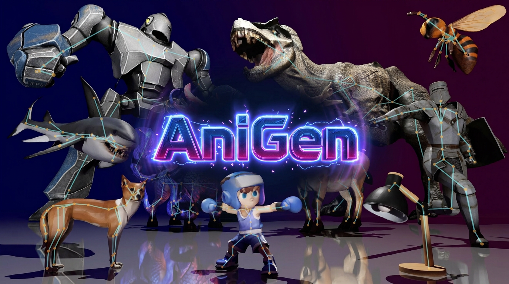
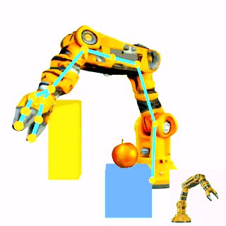
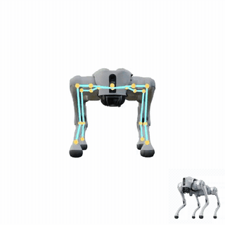
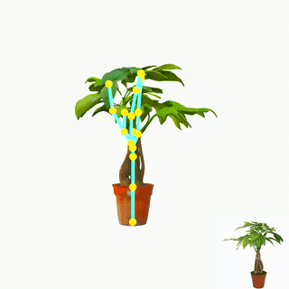
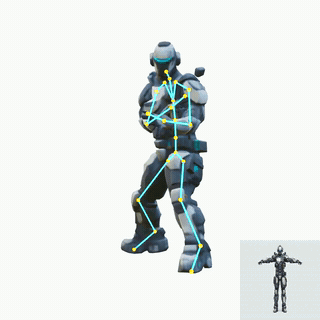
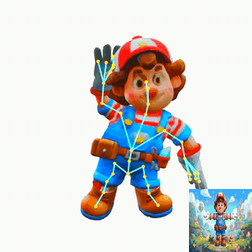
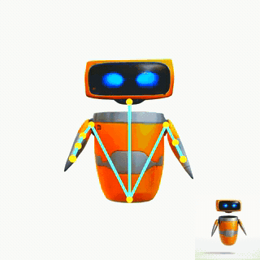
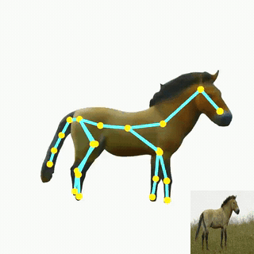
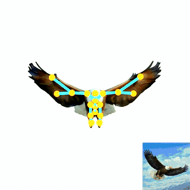

<h1 align="center">AniGen: Unified S<sup>3</sup> Fields for Animatable 3D Asset Generation</h1>
<p align="center"><a href="https://arxiv.org/pdf/2604.08746"></a>
<a href='https://yihua7.github.io/AniGen_web/'></a>
<a href='https://huggingface.co/spaces/VAST-AI/AniGen'></a>
<a href="https://www.tripo3d.ai"></a>
</p>
<p align="center"></p>

<span style="font-size: 16px; font-weight: 600;">A</span><span style="font-size: 12px; font-weight: 700;">niGen</span> is a unified framework that directly generates animate-ready 3D assets conditioned on a single image. Our key insight is to represent shape, skeleton, and skinning as mutually consistent *$S^3$ Fields* (Shape, Skeleton, Skin) defined over a shared spatial domain. To enable the robust learning of these fields, we introduce two technical innovations: (i) a *confidence-decaying skeleton field* that explicitly handles the geometric ambiguity of bone prediction at Voronoi boundaries, and (ii) a *dual skin feature field* that decouples skinning weights from specific joint counts, allowing a fixed-architecture network to predict rigs of arbitrary complexity. Built upon a two-stage flow-matching pipeline, <span style="font-size: 16px; font-weight: 600;">A</span><span style="font-size: 12px; font-weight: 700;">niGen</span> first synthesizes a sparse structural scaffold and then generates dense geometry and articulation in a structured latent space. Extensive experiments demonstrate that <span style="font-size: 16px; font-weight: 600;">A</span><span style="font-size: 12px; font-weight: 700;">niGen</span> substantially outperforms state-of-the-art sequential baselines in rig validity and animation quality, generalizing effectively to in-the-wild images across diverse categories including animals, humanoids, and machinery.

<!-- Apple Silicon Port -->
## 🍎 Apple Silicon (macOS / MPS) Port

> **This is a fork that adds Apple Silicon (M-series / Metal) inference support to AniGen.**
> Upstream AniGen is **Linux + NVIDIA CUDA only**. Here the CUDA-only pieces are swapped for
> Metal equivalents so the full single-image → rigged-mesh pipeline runs on a Mac GPU via
> PyTorch **MPS**. **Inference only** — training still requires CUDA.

**What's swapped (vendored in [`extern/`](extern/)):** CUDA sparse-conv (`spconv`) →
`flex_gemm`; `nvdiffrast` → `mtldiffrast`; CUDA mesh/BVH ops → `cumesh` / `mtlbvh`. Attention
runs in fp32 (MPS fused SDPA is disabled), and the fp16 pipeline is upcast to fp32.

This fork also includes a **value-add over vanilla AniGen**: generated skeletons that come out
as *disconnected components* are automatically reconnected into a single tree, so the rig
animates without frozen bones tearing the skin (the same disconnection exists on the CUDA path).

### Prerequisites (Mac)
- Apple Silicon Mac (M1 or newer), recent macOS.
- **Xcode Command Line Tools** (`xcode-select --install`) — provides `xcrun` / the Metal
  toolchain that compiles the `.metal` shaders in `extern/`.
- **Python 3.10**.

### Setup from scratch
```sh
git clone --recurse-submodules <this-fork-url> AniGen && cd AniGen

# 1. Python 3.10 virtual environment
python3.10 -m venv .venv-mac
source .venv-mac/bin/activate

# 2. Core dependencies (CPU/MPS wheels — no CUDA wheels)
pip install -r requirements-mac.txt

# 3. Vendored Metal extensions (each compiles a .metallib via xcrun;
#    install mtlbvh before mtlmesh, which depends on it)
pip install ./extern/mtlbvh ./extern/mtlgemm ./extern/mtldiffrast ./extern/mtlmesh
```
Pretrained weights download automatically on first run (`ensure_ckpts()` → Hugging Face); no
manual download needed.

### Usage
```sh
# Single image → results_mac/trex/{mesh.glb, skeleton.glb, processed_image.png}
python example_mps.py --image_path assets/cond_images/trex.png --output_dir results_mac
```
`example_mps.py` is the Mac entry point: it imports `anigen_mps` (which selects the Metal
backends and MPS env), injects `--device mps`, upcasts the pipeline to fp32, then runs
`example.py`. A run takes ≈3 min on an M-series GPU.

Mac-added fidelity flags (all optional):
- `--simplify_ratio` — fraction of faces removed in decimation (default `0.95`; lower keeps
  more geometry, e.g. `0.8` ≈ 4× the triangles). **The main fidelity lever.**
- `--texture_size` — baked texture resolution (default `1024`; `0` skips texturing).
- `--bake_mode {fast,opt}` — `fast` projective bake (Mac default) or `opt` differentiable
  multi-view bake.

> Everything below this section is upstream AniGen documentation (Linux / CUDA).

<!-- Overview -->
## 🔮 Overview

AniGen takes a **single image** as input and automatically produces a fully rigged, animate-ready 3D asset, complete with a coherent mesh, an articulated skeleton, and smooth skinning weights. The generated assets can be directly imported into standard 3D pipelines and driven by off-the-shelf motion data, enabling immediate deployment across a wide spectrum of downstream applications, including **embodied AI** agent construction, **physics-based simulation**, **character animation**, **dynamic scene creation**, and **articulated object manipulation**.

<table width="100%">
<tr>
<td width="25%" align="center"><br><b>Machine Arm</b></td>
<td width="25%" align="center"><br><b>Machine Dog</b></td>
<td width="25%" align="center"><br><b>Money Tree</b></td>
<td width="25%" align="center"><br><b>Iron Boy</b></td>
</tr>
<tr>
<td width="25%" align="center"><br><b>Mairo</b></td>
<td width="25%" align="center"><br><b>Evo</b></td>
<td width="25%" align="center"><br><b>Horse</b></td>
<td width="25%" align="center"><br><b>Eagle</b></td>
</tr>
</table>

<!-- Installation -->
## 📦 Installation

### Prerequisites
- **System**: The code is currently tested only on **Linux**.
- **Hardware**: An NVIDIA GPU with at least 18GB of memory is necessary. The code has been verified on NVIDIA A800 and RTX3090 GPUs.  
- **Software**:   
  - The [CUDA Toolkit](https://developer.nvidia.com/cuda-toolkit-archive) is needed to compile certain submodules. The code has been tested with CUDA versions 11.8 and 12.2.  
  - [Conda](https://docs.anaconda.com/miniconda/install/#quick-command-line-install) is recommended for managing dependencies.  
  - Python version 3.8 or higher is required. 

### Installation Steps
1. Clone the repo:
    ```sh
    git clone --recurse-submodules https://github.com/VAST-AI-Research/AniGen.git
    cd AniGen
    ```

2. Install the dependencies:

    We recommend using [uv](https://docs.astral.sh/uv/) for fast, reliable installs. The setup script will also work with plain `pip` if `uv` is not available.

    Create a new virtual environment and install everything:
    ```sh
    source ./setup.sh --new-env --all
    ```

    If your network connection to PyPI is unstable or slow, you can use the Tsinghua mirror:
    ```sh
    source ./setup.sh --new-env --all --tsinghua
    ```

    If you already have an environment with PyTorch installed, install into it directly:
    ```sh
    source ./setup.sh --basic
    ```

    > [!NOTE]
    > The setup script auto-detects your CUDA version and installs matching wheels for PyTorch, spconv, pytorch3d, and nvdiffrast. [DSINE](https://github.com/baegwangbin/DSINE) (used for surface normal estimation) is loaded at runtime via `torch.hub` and does not require separate installation.
    

<!-- Pretrained Models -->
## 🤖 Pretrained Models

We provide the following pretrained models on [Hugging Face](https://huggingface.co/VAST-AI/AniGen/tree/main). Please make sure to download all necessary weights from this page, including the required dinov2, dsine, and vgg checkpoints.

> [!TIP]
> **Recommended:** Use **SS-Flow-Duet** + **SLAT-Flow-Auto** if you do not have specific requirements.
> - For more detailed skeleton (including character fingers) → **SS-Flow-Duet**
> - For better geometry generalization → **SS-Flow-Solo**
> - **SLAT-Flow-Control** supports density levels 0–4, but if the density condition significantly deviates from the proper value for the object, skinning weights may be damaged.

| DAE Model | Description | Download |
| --- | --- | --- |
| SS-DAE | Encoder&Decoder of SS | [Download](https://huggingface.co/VAST-AI/AniGen/tree/main/ckpts/anigen/ss_dae) |
| SLAT-DAE | Encoder&Decoder of SLAT | [Download](https://huggingface.co/VAST-AI/AniGen/tree/main/ckpts/anigen/slat_dae) |

| SS Model | Description | Download |
| --- | --- | --- |
| SS-Flow-Duet | Detailed Skeleton (Full-FT Geo) | [Download](https://huggingface.co/VAST-AI/AniGen/tree/main/ckpts/anigen/ss_flow_duet) |
| SS-Flow-Epic | Geometry&Skeleton Balanced (LoRA-FT Geo) | [Download](https://huggingface.co/VAST-AI/AniGen/tree/main/ckpts/anigen/ss_flow_epic) |
| SS-Flow-Solo | Accurate Geometry (Freeze Geo) | [Download](https://huggingface.co/VAST-AI/AniGen/tree/main/ckpts/anigen/ss_flow_solo) |

| SLAT Model | Description | Download |
| --- | --- | --- |
| SLAT-Flow-Auto | Automatically Determine Joint Number | [Download](https://huggingface.co/VAST-AI/AniGen/tree/main/ckpts/anigen/slat_flow_auto) |
| SLAT-Flow-Control | Controllable Joint Density | [Download](https://huggingface.co/VAST-AI/AniGen/tree/main/ckpts/anigen/slat_flow_control) |

<!-- Usage -->
## 💡 Usage

### Minimal Example

Here is an [example](example.py) of how to use the pretrained models for 3D asset generation.


After running the code, you will get the following files:
- `mesh.glb`: a rigged mesh file
- `skeleton.glb`: a skeleton visualization file
- `processed_image.png`: the masked image as the condition

### AniGen Pipeline (Rigged Mesh + Skeleton)

For AniGen checkpoints in this repo (e.g. `ckpts/anigen/ss_flow_solo` + `ckpts/anigen/slat_flow_control`), you can run:
```sh
python example.py --image_path assets/cond_images/trex.png
```

### Web Demo

[app.py](app.py) provides a simple web demo for 3D asset generation. Since this demo is based on [Gradio](https://gradio.app/), additional dependencies are required:
```sh
source ./setup.sh --demo
```

If needed, you can also install the demo dependencies via the Tsinghua mirror:
```sh
source ./setup.sh --demo --tsinghua
```

After installing the dependencies, you can run the demo with the following command:
```sh
python app.py
```

Then, you can access the demo at the address shown in the terminal.

***The web demo is also available on [Hugging Face Spaces](https://huggingface.co/spaces/VAST-AI/AniGen)!***


<!-- Training -->
## 🏋️ Training

### Training Data

Sample training data is available at [AniGen-Sample-Dataset](https://huggingface.co/datasets/VAST-AI/AniGen-Sample-Dataset). To prepare your own data, refer to [TRELLIS](https://github.com/microsoft/TRELLIS) and the sample data format.

### Prerequisites

> [!NOTE]
> Training requires the **CUBVH** extension (`extensions/CUBVH/`), which is automatically built by `setup.sh`. It is **not** needed for inference (`app.py`, `example.py`).

### Training Commands

The pipeline has five stages. Later stages depend on earlier ones, so please train in order:

```sh
# Stage 1: Skin AutoEncoder
python train.py --config configs/anigen_skin_ae.json --output_dir outputs/anigen_skin_ae

# Stage 2: Sparse Structure DAE
python train.py --config configs/ss_dae.json --output_dir outputs/ss_dae

# Stage 3: Structured Latent DAE
python train.py --config configs/slat_dae.json --output_dir outputs/slat_dae

# Stage 4: SS Flow Matching (image-conditioned generation)
python train.py --config configs/ss_flow_duet.json --output_dir outputs/ss_flow_duet

# Stage 5: SLAT Flow Matching (image-conditioned generation)
python train.py --config configs/slat_flow_auto.json --output_dir outputs/slat_flow_auto
```

### Multi-Node / Multi-GPU

Append the following flags for distributed training across multiple machines and GPUs:

```sh
python train.py --config configs/<config>.json --output_dir outputs/<output> \
    --num_nodes XX --node_rank XX --master_addr XX --master_port XX
```

### Model Variants

Other SS Flow variants (`ss_flow_epic`, `ss_flow_solo`) and SLAT Flow variants (`slat_flow_control`, `slat_flow_gsn_auto`) are available under `ckpts/anigen/`. Their config files can be found at `ckpts/anigen/<variant>/config.json`.

### Resume / Restart

Training automatically resumes from the latest checkpoint in `--output_dir`. To start fresh, pass `--ckpt none`.


## License

This project's source code is released under the [MIT License](LICENSE).

> [!IMPORTANT]
> This repository includes third-party components with additional license restrictions. In particular, `extensions/CUBVH/` contains BVH code derived from NVIDIA's [instant-ngp](https://github.com/NVlabs/instant-ngp), which is licensed for **non-commercial / research use only**. See [THIRD_PARTY_LICENSES.md](THIRD_PARTY_LICENSES.md) for details.

## Acknowledgements

- [TRELLIS](https://github.com/microsoft/TRELLIS) by Microsoft
- [cuBVH](https://github.com/ashawkey/cubvh) by Jiaxiang Tang
- [tiny-cuda-nn](https://github.com/NVlabs/tiny-cuda-nn) and [instant-ngp](https://github.com/NVlabs/instant-ngp) by Thomas Müller / NVIDIA
- [FlexiCubes](https://github.com/nv-tlabs/FlexiCubes) by NVIDIA

We sincerely appreciate the contributions of these excellent projects and their authors. We believe open source helps accelerate research, lower barriers to innovation, and make progress more accessible to the broader community.


<!-- Citation -->
## 📜 Citation

If you find this work helpful, please consider citing our paper:

```bibtex
@article{huang2026anigen,
  title={AniGen: Unified $ S\^{} 3$ Fields for Animatable 3D Asset Generation},
  author={Huang, Yi-Hua and Zou, Zi-Xin and He, Yuting and Chang, Chirui and Pu, Cheng-Feng and Yang, Ziyi and Guo, Yuan-Chen and Cao, Yan-Pei and Qi, Xiaojuan},
  journal={arXiv preprint arXiv:2604.08746},
  year={2026}
}
```
