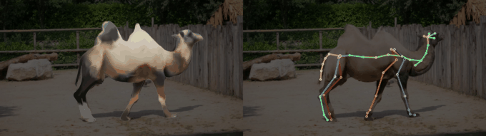
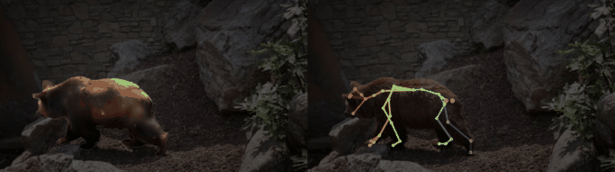

# anigen/4drecon — Monocular 4D reconstruction

Fit an AniGen-generated rig to a monocular video and render it back. A rigged mesh is produced
from the first frame, its pose is initialised with VGGT-Omega and refined with nvdiffrast, then
per-frame skeleton motion is optimised by **differentiable rendering** (silhouette + optical
flow + CoTracker3 point tracks), and the result is rendered from the original and cyclic views.




*Left: mesh overlay · Right: skeleton overlay (fit rendered over the darkened input frame) — DAVIS bear & camel.*

This is an **standalone** add-on. It is not imported by the core package and its
dependencies are not in the repo requirements — install them only if you use it.

## Install

```bash
# core extras (differentiable renderer, video IO, masks)
pip install imageio imageio-ffmpeg matplotlib opencv-python rembg einops timm kornia transformers
# optional: SpatialTracker V2 3D-track variant
pip install einx omegaconf hydra-core decord jaxtyping flow_vis "moviepy==1.0.3" "pycolmap==3.11.1" "pyceres==2.4"
```

## Third-party checkouts (cloned separately, not committed)

```bash
mkdir -p anigen/4drecon/third_party && cd anigen/4drecon/third_party
git clone https://github.com/facebookresearch/co-tracker      # CoTracker3 (default 2D tracks)
#   then place the checkpoint at co-tracker/checkpoints/scaled_offline.pth
git clone https://github.com/facebookresearch/vggt-omega      # VGGT-Omega (pose init); set VGGT_OMEGA_CKPT
git clone https://github.com/henry123-boy/SpaTrackerV2        # optional: 3D tracks
```

Paths are resolved in `paths.py` from env vars (override any):
`ANIGEN_DAVIS_ROOT`, `ANIGEN_4DRECON_TP`, `COTRACKER_REPO/COTRACKER_CKPT`,
`VGGT_OMEGA_REPO/VGGT_OMEGA_CKPT`, `SPATRACKER_REPO/SPATRACKER_FRONT_CKPT/SPATRACKER_OFFLINE_CKPT`.

## Data layout

`$ANIGEN_DAVIS_ROOT/JPEGImages/<seq>/*.jpg` (+ `Annotations/<seq>/*.png` masks). Outputs go to
`results/<seq>/`. For a raw video: extract frames, then `prep_video.py` makes masks
(BiRefNet-general, offline) + `assets/<seq>_rgba.png`.

## Pipeline

| # | Script | Output |
|---|---|---|
| prep | `prep_video.py --seq S` | masks + `assets/S_rgba.png` |
| 0 | `example.py` (repo root) | `results/S/mesh.glb`, `skeleton.glb` |
| 1 | `export_rig.py` + `symmetrize_colors.py` | `results/S/rig.npz` (verts/faces/colors/joints/parents/skin), `texture.png` |
| 2 | `render_views.py` | `results/S/views/` (renders + cameras) |
| 3 | `pose_init.py` | `results/S/vggt_pose.npz` (object→camera rotation) |
| 4 | `refine_pose.py` | `results/S/pose0.npz` (fixed full-frame camera + rigid pose) |
| 5 | `run_cotracker.py` (or `run_spatracker.py`) | `results/S/cotracker.npz` (tracks + visibility) |
| 6 | `fit_video.py` | `results/S/motion.npz` (per-frame bone/root, SO(3) parent-relative accel) |
| 7 | `render_results.py`, `viz_tracks.py`, `render_skeleton.py` | `results/S/renders/*.mp4` |

Run everything: `CUDA_VISIBLE_DEVICES=0 bash anigen/4drecon/run_all.sh <seq>`

## Key design

* World = AniGen canonical **Z-up**; cameras OpenCV world→camera; nvdiffrast native raster.
* Fixed full-frame camera from VGGT-Omega (gauge via rotation-averaging); apparent motion is a
  per-frame root rigid transform + per-bone rotations, applied by LBS/FK.
* Losses: soft-IoU/blurred-L2 silhouette + RAFT flow + CoTracker3 tracks (2D reprojection of
  mesh-bound "virtual vertices") + **SO(3) parent-relative** velocity/acceleration priors
  (constant-angular-velocity prediction `R_pred = ΔR·R_{t-1}` in each bone's parent frame).
* CoTracker3 is the default tracker (cleaner than SpatialTracker V2 on tested clips); masks via
  BiRefNet-general; both flanks share the observed-side texture color (`symmetrize_colors.py`).

## Modules

`paths.py` (config) · `geometry.py` (rotations, LBS/FK, cameras; `python geometry.py` runs self-tests)
· `renderer.py` (nvdiffrast silhouette/color/flow) · `davis.py` (loader + RAFT) · `fit_utils.py`
· `tracks.py` (track supervisor, auto-detects CoTracker3 / SpatialTracker).

## Notes

Tested on DAVIS `bear` (mean fit IoU 0.93) and `camel` (0.79; thinner limbs + self-occlusion +
back-fence in masks make it harder — use BiRefNet masks and stronger regularization
`--w_reg_bone 0.5 --w_temp_bone 8 --w_accel_bone 60`).
