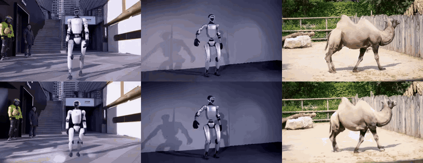

# AniGen Video Editing

Take an AniGen asset, give it a **new motion** and a **new camera**, and render it back into its own
video. The first frame stays the original — "same subject, new action".

<p align="center">
  <br>
  <sub><i>top: original clips &nbsp;·&nbsp; bottom: edited (new motion + camera), rendered with VACE</i></sub>
</p>

## One command

```bash
python edit.py --asset <name> --recon <recon_dir> --mask <recon_dir>/dynamic_mask --name <run> \
    --motion_source <.blend file | "text prompt"> \
    --camera_source <.npz file | "text prompt">      # optional; omit to keep the original camera
```

- **`--asset`** — a fitted asset under `results/<asset>/` (`rig_fit.npz` + `motion_fit.npz`), e.g. `camel`.
- **`--recon`** — a scene reconstruction of the source clip (depth + cameras + masks); see
  [The `--recon` input](#the---recon-input) below for the expected layout, e.g. `data/camel_edit/recon`.
- **`--mask`** — per-frame PNG masks of the subject to remove: the recon's `dynamic_mask/` (default),
  or DAVIS-style PNGs at any resolution with `--mask-kind gt-mask`.

The two things you actually choose each time: **the motion** and **the camera**.

### Motion — `--motion_source`
- **Edit it yourself.** Animate the asset's `results/<asset>/mesh.glb` in **Blender**, save a `.blend`,
  and pass it: `--motion_source your_edit.blend` (keep the mesh topology — we bake the per-frame pose).
  Or point at a folder of pre-exported per-frame `xyz/rgb` npz files.
- **Describe it in words.** Pass a `"text prompt"` and our agent authors the motion from the first
  frame: `--motion_source "do two jumping jacks then lean left"`.
  Set your key first: `export ANTHROPIC_API_KEY=...`.
- **Use a built-in preset.** `camel_rear_up`, `robot_jumping_jacks`, or `robot_combo` (what the
  `examples/` use).

### Camera — `--camera_source`
- **Default** — omit the flag to keep the original camera trajectory from the source clip.
- **Your own `.npz`** — a trajectory saved with `np.savez(out, c2w=<[F,4,4]>, intr=<[F,4] fx,fy,cx,cy>)`.
- **Describe it in words** — our camera agent designs it (needs `ANTHROPIC_API_KEY`):
  `--camera_source "slowly orbit the subject"` / `"dolly in"` / `"hold still"`.

## Examples

The examples read their recon dirs from `$ANIGEN_EDIT_DATA` (default `video_editing/data`); put your
recons there (e.g. `video_editing/data/camel_edit/recon`) or set the env var.

```bash
python examples/robot_g1_jumping_jacks.py   # G1 → jumping jacks + lean, slowly orbiting camera
python examples/robot_g1_3_combo.py         # G1 → hands-on-hips / wave / waist / squat, orbiting camera
python examples/camel_rear_up.py            # camel → rear up + alternating front paws, original camera
```

## How it works

`edit.py` removes the subject, inserts the re-animated asset (frame-0 aligned, feet planted, no slide),
renders the depth conditioning along `--camera_source`, and generates the final video with **VACE**
(Wan2.2-VACE-Fun-A14B) — the only external dependency, cloned as a sibling of AniGen (override with
`FREEORBIT4D_ROOT`; see that repo's README for the checkpoint). The point-cloud compositing and media IO
are vendored (`_pointcloud.py` / `_media.py`), so every step except the VACE render runs in the AniGen env.

### The `--recon` input
`--recon <dir>` is a one-off reconstruction of the source clip at **384×672**, produced by any
metric-depth + camera-pose + subject-segmentation pipeline. Expected layout:

```
<recon_dir>/
  video.mp4                # the source clip (49 frames)
  depths/NNNNN.exr         # per-frame metric depth (single channel)
  cameras.npz              # keys: cam_c2w[F,4,4], intrinsics[F,4] = fx,fy,cx,cy
  sky_mask/NNNNN.png       # per-frame sky mask (excluded from the background)
  dynamic_mask/NNNNN.png   # per-frame subject mask (what --mask points at)
```
